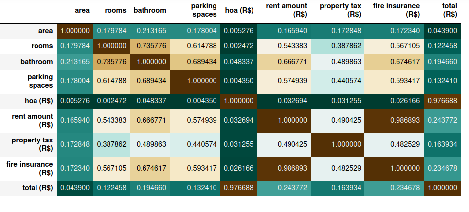

# Machine learing for predict rents
Performs an analysis with machine learning on a database of properties rents in Brazil.

For run the code online, click here

### A correlation matrix part of the code:

  

